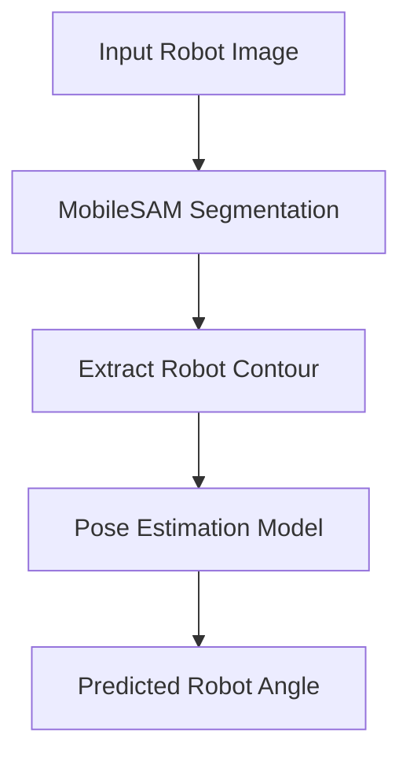

# Robot Pose Estimation using MobileSAM

## Project Overview

The objective was to estimate the robot orientation as accurately as possible by extracting its contour prior to angle prediction.

Instead of estimating the robot orientation directly from the original RGB image, the pipeline first extracts the robot contour using MobileSAM segmentation. The resulting contour representation is then used for pose estimation, reducing background noise and emphasizing the geometric information required for angle prediction.

---

## Project Objective

The goal of this project was to improve robot orientation estimation by using object contours rather than raw images.

The segmentation stage isolates the robot from the background, allowing the pose estimation model to focus only on the relevant object geometry.

---

## Pipeline

---

## Methodology

The project follows four main stages:

1. Load robot images.
2. Generate segmentation masks using MobileSAM.
3. Extract contour representations of the segmented robot.
4. Train a deep learning regression model to predict the robot's orientation from contour images.

The notebook also includes visualization of the generated contours together with the complete training process.

---

## Results

The notebook demonstrates:

- Robot contour extraction using MobileSAM.
- Visualization of contour images.
- Training and validation loss curves.
- Stable convergence of the optimization process during training.
- Successful robot angle estimation using contour-based image representations.

---

## Technologies

- Python
- PyTorch
- MobileSAM
- OpenCV
- NumPy
- Matplotlib
- Jupyter Notebook

---

## Skills Demonstrated

- Computer Vision
- Deep Learning
- PyTorch
- Image Segmentation
- MobileSAM
- Segment Anything Model (SAM)
- Robot Pose Estimation
- Contour Extraction
- Foundation Models
- Model Training
